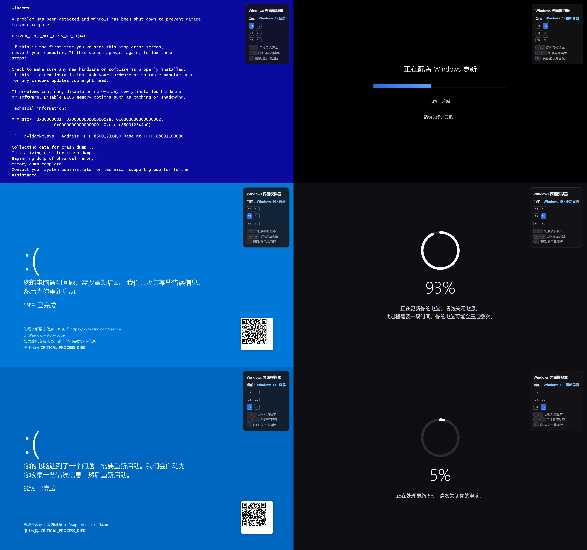

[English](https://github.com/Anan-up/Windows-Blue-Screen-Update-Webpage/blob/main/README.md) | [简体中文](https://github.com/Anan-up/Windows-Blue-Screen-Update-Webpage/blob/main/README_Simplified_Chinese.md) | [繁体中文](https://github.com/Anan-up/Windows-Blue-Screen-Update-Webpage/blob/main/README_Classical_Chinese.md)

## 文件概況

`win-screens.html`（約十七千字節，單一文件，不假外求）者，**Windows 藍屏暨系統更新界面之仿擬器**也。純以 HTML、CSS 與原生 JavaScript 為之，開卷即用，全屏沉浸，窮形盡相，示六種畢肖之系統界面。

## 功能架構：三乘二界面矩陣

| 系統版本 | 藍屏界面 | 更新界面 |
|---|---|---|
| **Windows 7** | 經典文本藍屏，報錯 `DRIVER_IRQL_NOT_LESS_OR_EQUAL`，附 STOP 碼 `0x000000D1` 及 `nvlddmkm.sys` 驅動崩潰之文，並錄完整內存轉儲之流程 | 黑底「正在配置 Windows 更新」之界面，藍色漸變進度條，戒曰「請勿關閉計算機」 |
| **Windows 10** | 新式 `:(` 藍屏，SVG 手繪二維碼，停止碼 `CRITICAL_PROCESS_DIED`，附 Bing 檢索之鏈 | 深色界面，綴圓形進度環（SVG stroke-dashoffset 動畫） |
| **Windows 11** | 更簡 `:(` 藍屏（`#0067c0` 色愈深，留白益多），二維碼並 support.microsoft.com 之鏈 | 圓形進度環，示「正在處理更新 X%」 |

## 交互設計

- **HUD 懸浮面板**（居於右上，毛玻璃之效）：實時示現今所處（如「Windows 10 · 藍屏」），內置三乘二網格按鈕（`1B/1U/2B/2U…`），觸之即達
- **鍵盤捷鍵**：`↑↓` 以換系統版本，`←→` 以易界面類型，`H` 以隱顯 HUD
- **動畫仿擬**：凡三套獨立進度動畫（Win7 進度條、藍屏「收集信息百分比」、圓形更新進度環），皆以 `Math.random()` 仿不規律之進退，務求逼真

## 技術之長

1. **還原入微**：Win7 藍屏以等寬字體並 `white-space: pre-wrap` 復其文本排版；Win10/11 之色彩、表情符號、右下白色二維碼（SVG path 所繪）皆一一肖其真
2. **隨形應變**：全屏字號以 `clamp()` 自適，佈局以 vw/vh 為度，不拘何種解像度，俱能全幅呈現
3. **不假外求**：一文件置諸瀏覽器，直開即用，宜乎演示、戲謔、前端習練之場

## 案影

## 版權

[MIT](LICENSE)
